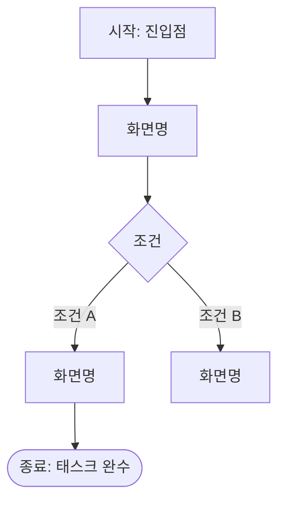

# User Flows 가이드

User Flows는 각 페르소나가 핵심 태스크를 완수하기 위해 이동하는 화면 경로를 시각화한 문서다.
Sitemap이 "무엇이 어디에 있는가"를 보여준다면, User Flows는 "어떻게 이동하는가"를 보여준다.

---

## 출력 경로

```
<워크스페이스>/user-flows.md
```

---

## 생성 시점

`sitemap.md` 생성 이후, 페르소나별 핵심 태스크가 2개 이상 식별될 때 생성한다.
User Story의 Given-When-Then 인수 조건에서 화면 전환 조건을 추출하여 흐름을 구성한다.

---

## 도출 규칙

1. Product Brief의 대상 사용자(페르소나)를 기준으로 플로우를 분리한다
2. 각 페르소나에서 Must 우선순위 Story의 핵심 태스크를 추출한다
3. Story의 Given(사전 조건)이 플로우의 시작점, Then(기대 결과)이 종료점이 된다
4. 분기는 Story의 AC(인수 조건)에서 조건 분기(When 절)를 추출한다
5. 화면명은 `sitemap.md`의 화면명과 일치시킨다

---

## 플로우 작성 규칙

### Mermaid flowchart 사용



**노드 유형:**
| 표기 | 의미 |
|------|------|
| `[화면명]` | 일반 화면 |
| `{조건}` | 분기점 (예: 로그인 여부, 권한) |
| `([종료])` | 태스크 완수 지점 |
| `([오류])` | 에러/실패 처리 |
| `[(DB)]` | 시스템 처리 (화면 없음) |

### 포함 범위
- **포함**: 사용자가 직접 보고 상호작용하는 화면 전환
- **포함**: 성공/실패 분기, 권한 분기
- **제외**: API 내부 처리, 서버 로직
- **제외**: 화면 내 UI 인터랙션 세부사항 (버튼 클릭, 입력 등)

---

## 업데이트 시점

- Story가 추가·수정되고 화면 전환이 변경될 때
- 새로운 페르소나가 추가될 때
- Story 상태가 cancelled로 변경될 때 해당 플로우 경로에 취소 표기

---

## 템플릿

→ `templates/user-flows.md` 참고

---

## 상대 링크 규칙

| 대상 | 링크 패턴 |
|------|-----------|
| Sitemap | `sitemap.md` |
| 관련 Story | `user-stories/us-NNN-[슬러그].md` |
| Product Backlog | `product-backlog.md` |
