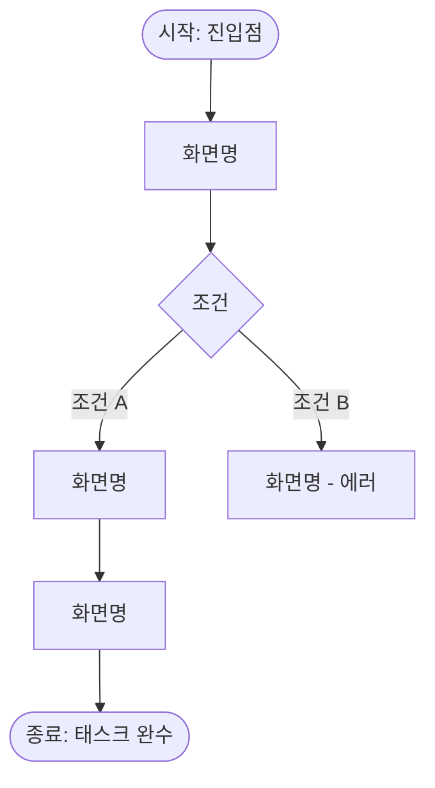
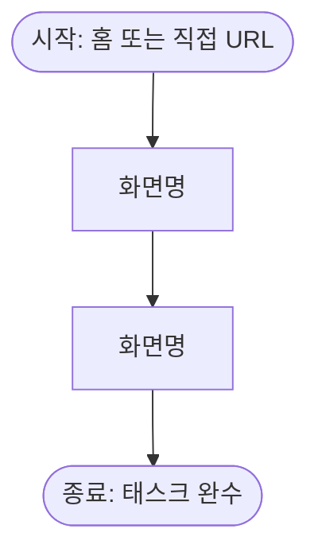
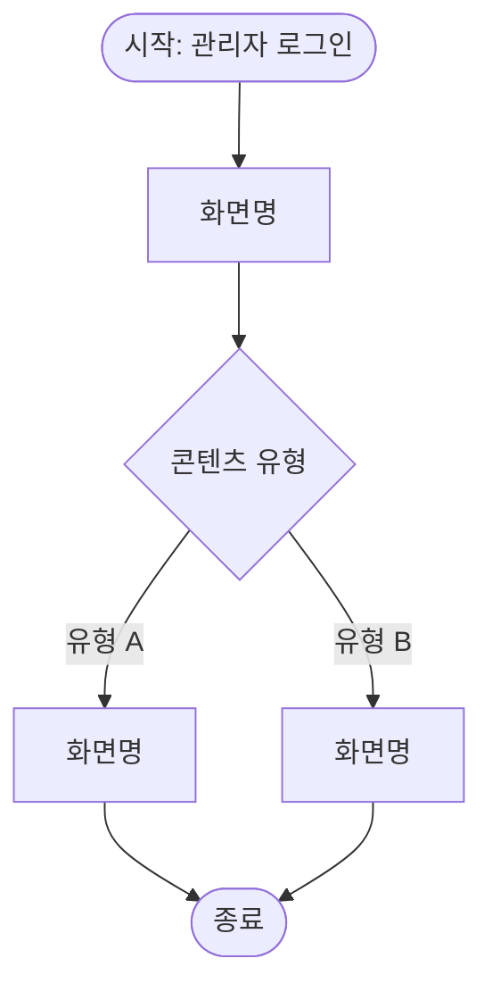

# User Flows

> 페르소나별 핵심 태스크 흐름. User Story의 AC(인수 조건)에서 도출한다.
> 화면명은 [sitemap.md](sitemap.md)와 일치시킨다.

---

## [페르소나명] — [태스크명] (예: 비회원 — 회원가입 후 첫 구매)

관련 Story: [US-NNN](user-stories/us-NNN-xxx.md), [US-NNN](user-stories/us-NNN-xxx.md)

| 단계 | 화면 | 사용자 행동 | 다음 화면 |
|------|------|------------|----------|
| 1 | (화면명) | (행동 설명) | (다음 화면명) |
| 2 | (화면명) | (행동 설명) | (다음 화면명) |
| 3 | (화면명) | (행동 설명) | 완료 |

---

## [페르소나명] — [태스크명] (예: 로그인 사용자 — 재구매)

관련 Story: [US-NNN](user-stories/us-NNN-xxx.md)

| 단계 | 화면 | 사용자 행동 | 다음 화면 |
|------|------|------------|----------|
| 1 | (화면명) | (행동 설명) | (다음 화면명) |
| 2 | (화면명) | (행동 설명) | 완료 |

---

## [페르소나명] — [태스크명] (예: 관리자 — 콘텐츠 관리)

관련 Story: [US-NNN](user-stories/us-NNN-xxx.md)

| 단계 | 화면 | 사용자 행동 | 다음 화면 |
|------|------|------------|----------|
| 1 | (화면명) | (행동 설명) | (다음 화면명) |

---

## 관련 문서

- [Sitemap](sitemap.md) — 전체 화면 계층 구조
- [Product Backlog](product-backlog.md)
