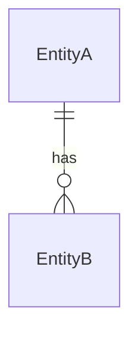

# Data Model

> 이 문서는 MVP 프론트엔드 검토 통과 후 생성된다. User Story에서 도출된 엔티티와 관계를 정의한다.

## 엔티티 목록

| 엔티티명 | 설명 | 관련 Story |
|----------|------|-----------|
| (엔티티명) | (설명) | [US-NNN](user-stories/us-NNN-xxx.md) |

## 엔티티 상세

### (엔티티명)

| 필드명 | 타입 | 필수 | 설명 |
|--------|------|------|------|
| id | UUID | Y | 기본 키 |
| (필드명) | (타입) | Y/N | (설명) |

### (엔티티명)

| 필드명 | 타입 | 필수 | 설명 |
|--------|------|------|------|
| id | UUID | Y | 기본 키 |

## 엔티티 관계

## 생성 이력

| 버전 | 날짜 | 변경 내용 |
|------|------|-----------|
| v1 | YYYY-MM-DD | 최초 생성 |
