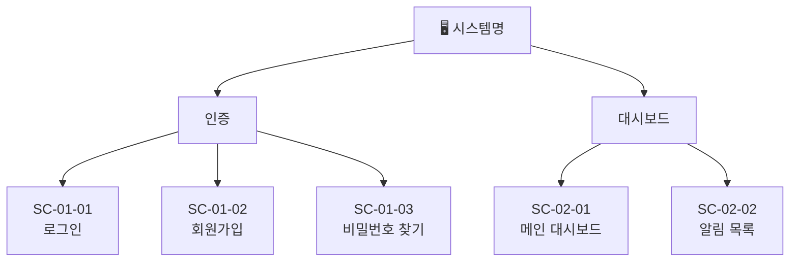

# screen-design-doc

RFP, 기획문서, 요구사항 메모 등 어떤 형태의 원본 문서라도 받아서 **IA(Information Architecture) 사이트맵**과 **화면별 설계서**를 Mermaid + MD 형식으로 만든다. 화면을 직접 구현하기 전에 "어떤 화면이 있고 각 화면에 무엇이 들어가는가"를 빠르게 정리하는 것이 목적이다.

---

## 지원 입력 형식

| 형식 | 처리 방식 |
|------|-----------|
| `.pdf` | 내장 Node.js 스크립트로 텍스트 추출 후 분석 |
| `.txt` | 직접 읽어서 분석 |
| `.md`  | 직접 읽어서 분석 |

그 외 파일 형식은 지원하지 않는다. 사용자에게 위 세 가지 중 하나로 변환해달라고 안내한다.

---

## 실행 절차

### Step 0 — 모드 감지

워크스페이스 루트에 `screen-design/` 폴더가 이미 존재하는지 확인한다.

- **`screen-design/` 없음** → **신규 생성 모드**: Step 1부터 진행
- **`screen-design/` 있음** → **업데이트 모드**: 아래 [업데이트 모드 상세 절차](#업데이트-모드-상세-절차)로 건너뜀

### Step 1 — 파일 확인

사용자가 제공한 파일 경로의 확장자를 확인한다.
- `.pdf/.txt/.md` 이외 → 명확한 오류 메시지와 함께 종료
- 파일이 존재하지 않으면 → 경로 재확인 요청

### Step 2 — 텍스트 추출

**PDF 입력일 때:**

```bash
# 의존성 설치 (최초 1회)
cd ~/.claude/skills/screen-design-doc/scripts && npm install --silent

# 텍스트 추출 — 반드시 이 경로로 저장
node ~/.claude/skills/screen-design-doc/scripts/extract_pdf_text.js \
  <입력.pdf> -o <워크스페이스_루트>/screen-design/extracted/source.txt
```

추출된 파일은 **반드시 `screen-design/extracted/source.txt`** 경로에 저장한다.

**TXT/MD 입력일 때:** Read 도구로 직접 읽는다.

### Step 3 — 요구사항 분석

텍스트에서 아래 항목을 식별한다:

1. **요구사항 ID 감지**: 원본 문서에 ID 패턴이 있는지 확인
   - 감지 패턴 예: `REQ-001`, `FR-01`, `F-001`, `요구사항번호` 등
   - 없으면 → ID 추적 생략, SC ID만 부여
   - 있으면 → 각 화면 도출 시 해당 요구사항 ID를 함께 기록

2. **화면 목록 도출**: 기능 단위를 화면 단위로 묶는다
   - 동일 목적/맥락의 기능 → 한 화면
   - 화면 간 계층 관계 파악 (메인 → 서브 → 상세)

3. **화면 그룹핑**: IA 상위 카테고리 결정 (예: 인증, 대시보드, 설정)
   - 그룹 번호가 SC ID의 첫 번째 자리가 된다

분석 결과를 아래 형식으로 정리한 뒤 다음 단계로 진입한다:
```
[그룹 01: 인증]
  - SC-01-01: 로그인 화면 ← REQ-001, REQ-002
  - SC-01-02: 회원가입 화면 ← REQ-003
  - SC-01-03: 비밀번호 찾기 화면 ← REQ-004

[그룹 02: 대시보드]
  - SC-02-01: 메인 대시보드 ← REQ-010, REQ-011
  - SC-02-02: 알림 목록 ← REQ-012
```

### Step 4 — IA 사이트맵 생성

`references/screen-design-guide.md`의 IA 패턴을 참고해 전체 화면 계층을 Mermaid로 표현한다.



`screen-design/ia-sitemap.md`에 저장한다.

### Step 5 — 화면설계서 생성

화면별로 넘버링된 MD 파일을 생성한다. `references/screen-design-guide.md`의 화면설계서 템플릿을 기준으로 작성한다.

**화면 ID 체계**: `SC-[그룹번호]-[순번]` (예: `SC-01-01`, `SC-02-03`)
**파일명**: 전체 순번 2자리 + 영문명 (예: `01-login.md`, `04-dashboard.md`)

각 화면설계서 파일 구성:
- 화면 기본 정보 (ID, 화면명, 목적, 진입 경로, 이전/다음 화면)
- 주요 영역/섹션
- 컴포넌트 목록 (영역별 UI 요소)
- 사용자 액션 → 화면 전환 테이블
- 요구사항 추적 테이블 (요구사항 ID가 있는 경우)

파일 넘버링은 그룹 순서대로 전체 화면을 이어서 붙인다:
```
01-login.md           (SC-01-01)
02-signup.md          (SC-01-02)
03-forgot-password.md (SC-01-03)
04-dashboard.md       (SC-02-01)
```

### Step 6 — 결과물 저장 및 보고

워크스페이스 루트 `screen-design/` 폴더:

```
screen-design/
├── README.md               ← 화면 그룹 목록, SC ID 인덱스, 파일 링크
├── ia-sitemap.md           ← 전체 화면 계층 Mermaid
├── 01-login.md             ← 화면설계서
├── 02-signup.md
├── ...
└── extracted/              ← PDF 입력 시만
    └── source.txt
```

저장 완료 후 생성된 화면 수, 그룹 구조, 파일 목록을 사용자에게 보고한다.

---

## 업데이트 모드 상세 절차

워크스페이스에 이미 `screen-design/` 폴더가 있을 때 사용하는 플로우다.

### U-Step 1 — 현황 파악

기존 파일을 모두 읽어 현재 상태를 파악한다:
- `screen-design/README.md` — 화면 목록, 그룹 구조
- `screen-design/ia-sitemap.md` — 현재 IA 구조
- `screen-design/[번호]-[화면명].md` — 각 화면설계서

현재 SC ID 마지막 번호, 그룹 구조, 화면 수를 파악해둔다.

### U-Step 2 — 변경 내용 파악

- **새 문서가 있는 경우**: Step 1~3을 수행한 뒤 기존 현황과 비교
- **구두 지시만 있는 경우**: 사용자 설명에서 직접 변경사항 도출

변경 유형 분류:
```
[추가] 새 화면, 새 그룹, 새 컴포넌트
[수정] 화면명 변경, 컴포넌트 변경, 액션 변경
[삭제] 화면 제거, 그룹 통합
```

애매한 부분이 있으면 작업 전에 사용자에게 확인한다.

### U-Step 3 — 선택적 수정

변경이 있는 파일만 수정한다.

| 변경 유형 | 수정 대상 파일 |
|-----------|----------------|
| 특정 화면 내용 변경 | 해당 화면 `.md` + `ia-sitemap.md` (구조 변경 시) + `README.md` |
| 새 화면 추가 | 새 화면 `.md` 생성 + `ia-sitemap.md` + `README.md` |
| 화면 삭제 | 해당 `.md` 삭제 + `ia-sitemap.md` + `README.md` |
| 새 그룹 추가 | 해당 그룹 화면 `.md` + `ia-sitemap.md` + `README.md` |

**SC ID 처리:**
- 기존 SC ID는 절대 변경하지 않는다 (추적 이력 보존)
- 새 화면은 해당 그룹의 마지막 SC 순번 다음을 이어서 부여한다
- 새 그룹은 기존 마지막 그룹 번호 다음을 이어서 부여한다
- 삭제된 SC의 ID는 재사용하지 않는다

**파일 넘버링:**
- 새 파일은 마지막 전체 순번 다음을 이어서 붙인다
- 중간 삽입이 필요한 경우 이후 파일 번호 재조정 + `README.md` 링크 업데이트

### U-Step 4 — 변경 요약 보고

```
✅ 업데이트 완료

[수정된 파일]
- 03-product-list.md: 필터 컴포넌트 추가
- ia-sitemap.md: 결제 그룹 화면 반영

[추가된 파일]
- 07-payment.md: 결제 화면 신규 추가 (SC-03-01)

[변경 없는 파일]
- 01-login.md, 02-signup.md (변경 없음)
```

---

## 참고 파일

- `references/screen-design-guide.md` — IA 사이트맵 Mermaid 패턴, 화면설계서 템플릿, SC ID 체계, 요구사항 추적 테이블 형식
