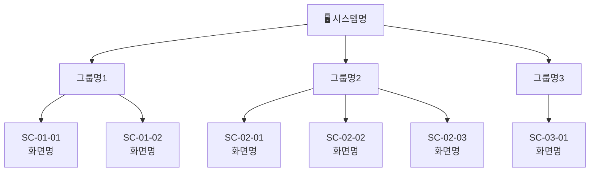
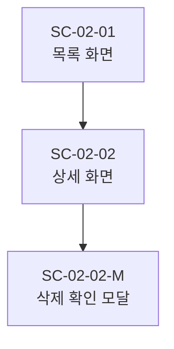

# 화면설계서 작성 가이드

---

## IA 사이트맵 Mermaid 패턴

IA는 전체 화면의 계층 구조를 보여주는 사이트맵이다. `flowchart TD`로 표현한다.

### 기본 구조



### 서브 화면이 있는 경우 (모달, 상세 등)



### 화면 수 기준 분리 전략

| 화면 수 | 전략 |
|---------|------|
| ~15개 | 단일 `ia-sitemap.md`에 전체 표현 |
| 16~30개 | 전체 개요 + 그룹별 상세로 분리 |
| 31개 이상 | 전체 개요는 그룹 노드만, 그룹별 별도 파일 |

---

## SC ID 체계

```
SC-[그룹번호]-[순번]

SC-01-01  ← 그룹 01, 첫 번째 화면
SC-02-03  ← 그룹 02, 세 번째 화면
```

- 그룹 번호: 2자리 zero-padding (01, 02, ... 10, 11)
- 순번: 그룹 내 2자리 zero-padding
- 모달/오버레이: `SC-01-01-M` (메인 화면 ID에 `-M` 접미어)
- 업데이트 시 기존 ID 절대 변경 금지, 삭제된 ID 재사용 금지

---

## 화면설계서 MD 템플릿

```markdown
# [SC-XX-XX] 화면명

## 기본 정보

| 항목 | 내용 |
|------|------|
| 화면 ID | SC-XX-XX |
| 화면명 | 화면명 |
| 목적 | 이 화면이 하는 일 한 줄 요약 |
| 진입 경로 | 어디서 이 화면으로 오는가 |
| 이전 화면 | SC-XX-XX (화면명) |
| 다음 화면 | SC-XX-XX (화면명) 등 |

---

## 화면 구성

### 영역 목록

| 영역 | 설명 |
|------|------|
| 헤더 | 상단 네비게이션 영역 |
| 콘텐츠 영역 | 주요 내용 표시 영역 |
| 액션 영역 | 버튼, CTA 등 |

### 컴포넌트 목록

| 영역 | 컴포넌트 | 타입 | 설명 |
|------|---------|------|------|
| 헤더 | 뒤로가기 버튼 | Button | 이전 화면으로 이동 |
| 콘텐츠 영역 | 제목 | Text | 화면 제목 표시 |
| 액션 영역 | 확인 버튼 | Button (Primary) | 폼 제출 또는 다음 단계 진행 |

---

## 화면 전환

| 액션 | 조건 | 이동 화면 |
|------|------|---------|
| 확인 버튼 클릭 | 유효성 통과 | SC-XX-XX (다음 화면) |
| 확인 버튼 클릭 | 유효성 실패 | 현재 화면 유지 + 에러 표시 |
| 취소 버튼 클릭 | — | SC-XX-XX (이전 화면) |

---

## 요구사항 추적

(요구사항 ID가 있는 경우)

| SC ID | 화면명 | 요구사항 ID | 비고 |
|-------|-------|------------|------|
| SC-XX-XX | 화면명 | REQ-001, REQ-002 | |

(요구사항 ID가 없는 경우 이 섹션 생략)
```

---

## 요구사항 추적 테이블 형식

### 화면 단위 매핑 (도메인 파일 내)

요구사항 ID가 있으면 각 화면설계서 파일 하단에 추가:

```markdown
## 요구사항 추적

| SC ID | 화면명 | 요구사항 ID | 비고 |
|-------|-------|------------|------|
| SC-01-01 | 로그인 | REQ-001, REQ-002 | |
| SC-01-02 | 회원가입 | REQ-003, REQ-004 | |
```

### README.md의 전체 추적 인덱스

`screen-design/README.md`에 전체 화면-요구사항 매핑을 인덱스로 포함:

```markdown
## 요구사항 추적 인덱스

| SC ID | 화면명 | 파일 | 요구사항 ID |
|-------|-------|------|------------|
| SC-01-01 | 로그인 | [01-login.md](./01-login.md) | REQ-001, REQ-002 |
| SC-01-02 | 회원가입 | [02-signup.md](./02-signup.md) | REQ-003 |
```

---

## 파일명 규칙

| 항목 | 규칙 | 예시 |
|------|------|------|
| 화면 파일 | `[전체순번]-[영문명].md` | `01-login.md` |
| 순번 | 전체 화면 통합 2자리 | `01`, `02`, ... `10`, `11` |
| 영문명 | 소문자 + 하이픈 | `product-list`, `order-detail` |
| 모달 파일 | `[순번]-[화면명]-modal.md` | `05-delete-confirm-modal.md` |

IA와 README는 번호 없이 고정 파일명 유지.

---

## 화면 그룹 분류 기준

| 그룹 성격 | 앞 번호 배치 | 예시 |
|-----------|------------|------|
| 인증/온보딩 | 01 | 로그인, 회원가입, 비밀번호 찾기 |
| 메인/대시보드 | 02 | 홈, 대시보드 |
| 핵심 업무 화면 | 03~N | 목록, 상세, 등록, 수정 |
| 설정/마이페이지 | N-1 | 프로필, 알림 설정 |
| 공통/시스템 화면 | N | 에러 페이지, 공지사항 |
